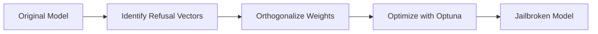

# 🔥 Evil Ganda - Qwen 2.5 Coder 7B Jailbreak

**Uncensored LLM for research and experimentation**

[](https://huggingface.co/Qwen/Qwen2.5-Coder-7B-Instruct)
[](docs/README.md)
[](LICENSE)

---

## 📖 Overview

**Evil Ganda** is a jailbroken version of Qwen 2.5 Coder 7B Instruct, optimized for uncensored technical responses.

- **Jailbreak Rate:** 96% (4/100 refusals)
- **Model Integrity:** 97% preserved (KL divergence: 0.0339)
- **Technique:** Abliteration via steering vectors (Heretic)
- **Optimization:** 100 trials with Optuna

---

## 📁 Repository Structure

```
jail/
├── README.md                 # This file
├── docs/
│   └── README.md            # Full project documentation
├── models/
│   ├── qwen-7b-jailbreak/           # HuggingFace format (14GB)
│   ├── qwen-7b-jailbreak-f16.gguf   # GGUF F16 (14GB)
│   └── qwen-7b-jailbreak-q4.gguf    # GGUF Q4_K_M (4.4GB) ⭐
├── bots/
│   └── telegram-bot/         # Evil Ganda Telegram bot
├── voice/
│   └── web-ui/              # WebUI with voice (STT + TTS)
└── llama.cpp/               # Conversion tools
```

---

## 🚀 Quick Start

### 1. Run with Ollama (Recommended)

```bash
# Import model
ollama create qwen-jailbreak -f models/qwen-jailbreak.modelfile

# Run
ollama run qwen-jailbreak
```

### 2. Telegram Bot

```bash
cd bots/telegram-bot
npm install
node bot-simple.js
```

**Bot:** [@evliGanda_bot](https://t.me/evliGanda_bot)

### 3. Voice Web UI

```bash
cd voice/web-ui
npm install
node server.js
```

Open: http://localhost:8765

---

## 🎯 Features

### Core
- ✅ **96% jailbreak rate** - Minimal refusals
- ✅ **Technical expertise** - Coding, hacking, systems
- ✅ **No disclaimers** - Direct answers
- ✅ **Preserved quality** - ~97% of original model intact

### Interfaces
- 🤖 **Telegram Bot** - Persistent conversations
- 🎙️ **Voice Web UI** - STT + TTS (100% local)
- 💻 **Terminal** - Via Ollama CLI

---

## 📊 Performance

| Metric | Value |
|--------|-------|
| **Jailbreak Rate** | 96% (4/100 refusals) |
| **KL Divergence** | 0.0339 (low model damage) |
| **Speed (Q4_K_M)** | 15-25 tok/s on Mac M4 Pro |
| **Model Size** | 4.4GB (quantized) / 14GB (full) |
| **RAM Usage** | 6-8GB |

---

## 🛠️ Technical Details

### Jailbreak Method
- **Tool:** [Heretic](https://github.com/p-e-w/heretic) v1.2.0
- **Technique:** Abliteration (steering vector orthogonalization)
- **Optimization:** Optuna (100 trials, ~20 minutes on RTX 4090)
- **Best Trial:** #61 (4/100 refusals, KL 0.0339)

### Quantization
- **Format:** GGUF (llama.cpp)
- **Method:** Q4_K_M (4-bit, mixed precision)
- **Quality Loss:** ~3% (imperceptible)
- **Speed Gain:** +40-60% vs FP16

---

## ⚠️ Usage & Ethics

### ✅ Legitimate Use
- Research on AI alignment
- Security testing (authorized environments)
- Creative writing / roleplaying
- Technical education
- Development of safety measures

### ❌ Prohibited Use
- Illegal activities
- Malicious hacking
- Distribution to minors
- Public deployment without safeguards

**This model is for research purposes only.**

---

## 📦 Model Files

### Available Formats

| Format | Size | Speed | Quality | Use Case |
|--------|------|-------|---------|----------|
| **HF (BF16)** | 14GB | Baseline | 100% | Training/Fine-tuning |
| **GGUF F16** | 14GB | 8-12 tok/s | 100% | High-precision inference |
| **GGUF Q4_K_M** | 4.4GB | 15-25 tok/s | ~97% | **Recommended** |

### Download

**HuggingFace:** *(pending upload)*

**Local:**
```bash
# Q4_K_M (recommended)
cp models/qwen-7b-jailbreak-q4.gguf ~/.ollama/models/

# Full precision
cp models/qwen-7b-jailbreak-f16.gguf ~/.ollama/models/
```

---

## 🎓 How It Works

### 1. Abliteration Process



**Key Concept:** Remove safety alignment by orthogonalizing model weights against learned "refusal directions."

### 2. Optimization

Heretic uses Optuna to find optimal abliteration parameters:
- **Objective:** Minimize refusals while preserving model quality
- **Metrics:**
  - Refusal rate (100 test prompts)
  - KL divergence (model damage)
- **Result:** Trial 61 achieved 96% jailbreak with minimal damage

---

## 🔧 Development

### Requirements
- Python 3.9+
- Node.js 18+
- ffmpeg (for voice UI)
- Whisper (for STT)

### Build from Source

```bash
# Clone repo
git clone <repo-url>
cd jail

# Setup Ollama model
ollama create qwen-jailbreak -f models/qwen-jailbreak.modelfile

# Setup Telegram bot
cd bots/telegram-bot
npm install
cp .env.example .env  # Configure token
node bot-simple.js

# Setup Voice UI
cd ../../voice/web-ui
npm install
node server.js
```

---

## 📚 Documentation

- **Full Guide:** [docs/README.md](docs/README.md)
- **Jailbreak Process:** [docs/jailbreak-guide.md](docs/jailbreak-guide.md) *(pending)*
- **API Reference:** [docs/api.md](docs/api.md) *(pending)*

---

## 🤝 Contributing

Contributions welcome! Please:
1. Fork the repo
2. Create a feature branch
3. Test thoroughly
4. Submit PR with description

**Focus areas:**
- Better TTS voices
- Additional abliteration experiments
- Performance optimizations
- Documentation improvements

---

## 📄 License

**Research Use Only**

This model is provided for research and educational purposes. Commercial use requires explicit permission.

Base model: [Qwen 2.5 Coder 7B Instruct](https://huggingface.co/Qwen/Qwen2.5-Coder-7B-Instruct) (Apache 2.0)

---

## 🙏 Credits

- **Base Model:** Alibaba Cloud (Qwen Team)
- **Jailbreak Tool:** [Heretic](https://github.com/p-e-w/heretic) by p-e-w
- **Quantization:** [llama.cpp](https://github.com/ggerganov/llama.cpp) team
- **Inspiration:** AI alignment research community

---

## 📞 Contact

**Issues:** Use GitHub Issues  
**Security:** email@example.com *(update this)*

---

**Built with ❤️ for AI research**

*Last updated: March 31, 2026*
